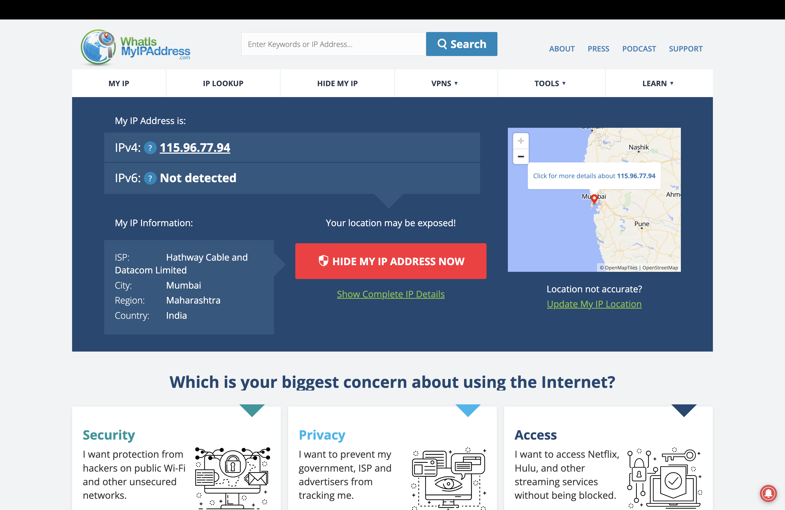
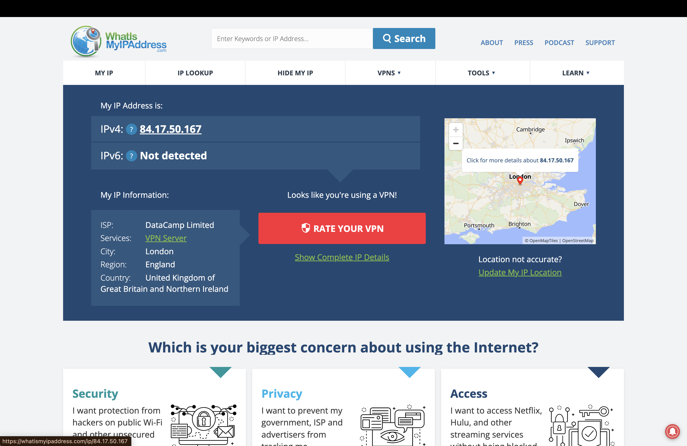

# Cyber Security Internship - Task 8

## Task Title: Identify and Remove Suspicious Browser Extensions & Understand VPN Functionality

---

### 🔐 Objective
Gain hands-on experience with using VPNs to protect online privacy and understand how VPNs affect IP addresses, encryption, and network speed.

---

### 🛠 Tools Used
- VPN Service: **Windscribe (Free Tier)**
- Website: [whatismyipaddress.com](https://whatismyipaddress.com)
- OS: macOS (or your OS)

---

### 📷 Screenshots

- **Before VPN Connection (Actual IP - Mumbai, India):**  
  

- **After VPN Connection (VPN IP - London, UK):**  
  

- **Windscribe VPN Interface (Connected):**  
  

---

### 🔄 Steps Followed

1. Signed up for a **free Windscribe VPN** account.
2. Downloaded and installed the Windscribe desktop app.
3. Logged in and connected to the "Best Location" server.
4. Verified IP address changed using whatismyipaddress.com.
5. Observed that location changed from **Mumbai, India** to **London, UK**.
6. Browsed websites securely through VPN.
7. Disconnected VPN and compared IP and speed.

---

### 📄 VPN Summary

#### ✅ Benefits:
- Hides real IP address and location.
- Encrypts all internet traffic.
- Bypasses geo-blocks and censorship.
- Protects on public Wi-Fi.

#### ⚠️ Limitations:
- Slower internet speed (due to encryption/tunneling).
- Free VPNs have data limits.
- VPNs can't guarantee complete anonymity.
- Not all VPNs are equally secure — some log user activity.

---

### ✅ Task Complete

This task gave me hands-on exposure to VPN setup, privacy protection, and security awareness. All required screenshots and explanations are included in this repo.

